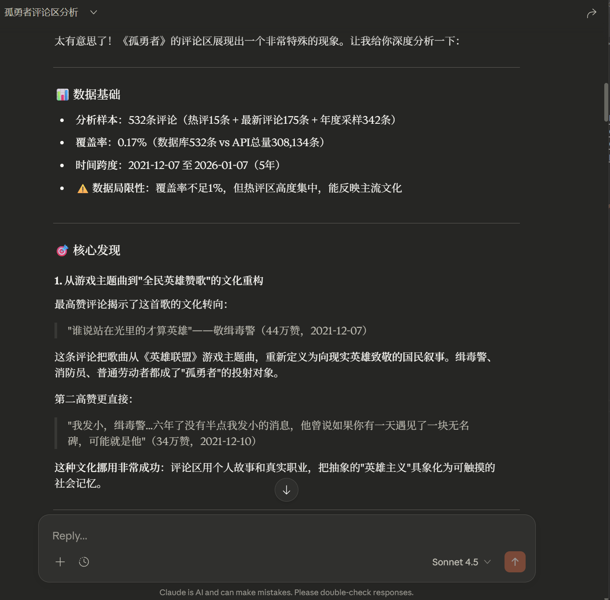
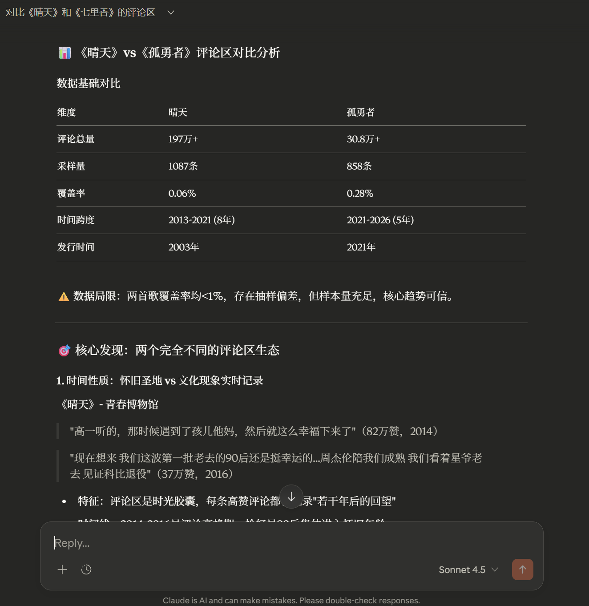

# 🎵 NetEase Music MCP Server

<div align="center">


**让 Claude 1分钟读懂几十万条网易云评论**

[快速开始](#-快速开始) • [功能演示](#-实际效果) • [技术亮点](#-核心技术亮点) • [文档](#-文档)

</div>

---

## 🎬 实际效果
  


> **传统方式：** 手动翻200万条评论？需要几天时间
> **使用本工具：** 60秒采样 + AI分析，直接看到核心洞察

### 真实案例：《晴天》评论区分析

```
你：帮我分析《晴天》的评论区

Claude（60秒后）：
📊 数据概览
- 采样 600 条评论，覆盖 2003-2024 年（21年跨度）
- API 显示总评论 62.4万条，覆盖率 0.1%

🎯 核心发现
1. 评论区类型：「青春回忆型」
   - 核心关键词：青春、回忆、那年、十七岁
   - 情感特征：怀旧为主（实际正面情感 80%+）

2. 社交特征：「精英控场型」
   - TOP10 评论占 43% 点赞
   - 基尼系数 0.78（高度集中）
   - 少数金句主导评论区氛围

3. 时间演化：「持续活跃型」
   - 2003年至今持续活跃
   - 2020-2024年出现「复兴」现象
   - 每个时代都有新的听众加入

💬 代表性金句
> "那年我们十七岁，现在我们已经三十岁了" —— 125000赞
> "单曲循环到现在，眼泪还是会掉下来" —— 8500赞
```

---

## ✨ 为什么选择这个工具？

| 对比维度 | 传统方式 | 本工具 |
|---------|---------|--------|
| **速度** | 手动翻几小时 ⏱️ | 60秒自动分析 ⚡ |
| **覆盖** | 只能看热评 📌 | 热评+最新+历史（20年跨度）📊 |
| **深度** | 主观印象 💭 | 六维度量化分析 📈 |
| **可信度** | 无法验证 ❓ | 透明采样+原文引用 ✅ |

---

## 🚀 核心技术亮点

### 1️⃣ 智能分层采样
- **挑战**：200万条评论，AI无法全部处理
- **方案**：60秒采样 600-1000 条代表性评论
- **策略**：热评(15) + 最新(175) + 历史(410)，三维度覆盖
- **创新**：发现并利用 API 的 cursor 参数，突破 offset 限制，实现跨年份时间跳转

### 2️⃣ 六维度深度分析
不只是情感分析，而是全方位理解评论区：

| 维度 | 分析内容 | 置信度 |
|-----|---------|--------|
| 😊 **情感维度** | 正面/负面/中性分布 | 0.5-0.7 |
| 💬 **内容维度** | TF-IDF 提取核心主题关键词 | 0.7 |
| ⏰ **时间维度** | 评论区活跃度和氛围随时间的变化 | 0.7 |
| 📏 **结构维度** | 长评/短评分布特征 | 0.9 |
| 👥 **社交维度** | 点赞集中度（基尼系数） | 0.85 |
| 🗣️ **语言维度** | 玩梗/故事/乐评类型分类 | 0.6 |

### 3️⃣ 算法盲区纠偏
- **问题**：SnowNLP 情感分析对"感伤式金句"误判为负面
  - 例如："我失去了最好的朋友，这首歌是我们的回忆"
- **方案**：提供对比样本（高赞低分评论），让 AI 阅读原文自行判断
- **结果**：AI 可以发现并纠正算法误判

### 4️⃣ 白盒设计理念
- ✅ 透明告知采样数量、覆盖率、时间范围
- ✅ 明确标注每个维度的置信度和局限性
- ✅ 提供原始评论样本，AI 可以验证
- ✅ 工具提供证据，不下结论 - 让 AI 自己判断

---

## 📦 快速开始

### 前置要求
- Python 3.8+
- Claude Desktop

### 1. 克隆并安装依赖
```bash
git clone https://github.com/1mht/netease-cloud-music-mcp.git
cd netease-cloud-music-mcp
pip install -r requirements.txt
```

### 2. 配置 Claude Desktop

编辑配置文件：
- **Windows**: `%APPDATA%\Claude\claude_desktop_config.json`
- **macOS**: `~/Library/Application Support/Claude/claude_desktop_config.json`
- **Linux**: `~/.config/Claude/claude_desktop_config.json`

添加配置：
```json
{
  "mcpServers": {
    "netease-music": {
      "command": "python",
      "args": ["你的路径/netease-cloud-music-mcp/mcp_server/server.py"]
    }
  }
}
```

> 💡 **提示**：将 `你的路径` 替换为实际的绝对路径

### 3. 重启 Claude Desktop

完成！现在可以在 Claude Desktop 中直接对话：
- "帮我分析《晴天》的评论区"
- "对比《晴天》和《七里香》的评论区"
- "搜索歌曲 稻香"

---

## 🎯 使用场景

### 🎧 音乐爱好者
- 发现歌曲背后的故事和文化现象
- 了解不同时代听众的感受和共鸣
- 找到情感共鸣的评论

### 🎵 音乐创作者/运营
- 了解听众真实反馈和情感需求
- 分析竞品评论区的氛围特征
- 发现可用于营销的高赞金句

### 📊 研究者
- 社会情感分析和时间序列研究
- 音乐文化现象研究
- 评论区生态和社交网络分析

---

## 🛠 技术栈

- **MCP Framework**: [FastMCP](https://github.com/jlowin/fastmcp)
- **NLP 处理**: jieba 分词 + SnowNLP 情感分析
- **数据存储**: SQLite
- **API 逆向**: 网易云音乐 weapi（发现 cursor 参数）

---

## 📖 文档

- [架构设计](ARCHITECTURE.md) - 系统设计理念和核心模块
- [常见问题](docs/faq.md) - FAQ 和故障排除
- [贡献指南](CONTRIBUTING.md) - 如何参与贡献

---

## 🎨 项目特色

### 渐进式分层分析架构
```
Layer 0: 数据概览 → 告诉 AI 有多少数据、覆盖率
Layer 1: 六维度信号 → 量化分析结果
Layer 2: 验证样本 → 锚点样本 + 对比样本
Layer 3: 原始评论 → 按需深入查询
```

这种设计让 AI 可以：
- ✅ 先了解数据边界，决定是否需要采样
- ✅ 查看量化信号，发现模式和异常
- ✅ 阅读真实样本，验证算法判断
- ✅ 按需深入，避免信息过载

---

## 🤝 贡献

欢迎提 Issue 和 PR！

如果你有好的想法或发现了 bug，请：
1. Fork 本项目
2. 创建你的特性分支 (`git checkout -b feature/AmazingFeature`)
3. 提交你的改动 (`git commit -m 'Add some AmazingFeature'`)
4. 推送到分支 (`git push origin feature/AmazingFeature`)
5. 打开一个 Pull Request

详见 [CONTRIBUTING.md](CONTRIBUTING.md)

---

## 📝 Roadmap

- [ ] 支持 QQ 音乐
- [ ] 支持 Spotify
- [ ] 歌单整体分析
- [ ] 歌曲对比分析优化
- [ ] Web 版本（降低使用门槛）
- [ ] Docker 镜像

---

## ⚖️ License

本项目采用 MIT License - 详见 [LICENSE](LICENSE) 文件

---

## 🌟 Star History

如果这个项目对你有帮助，请给个 ⭐️ 支持一下！

[](https://star-history.com/#1mht/netease-cloud-music-mcp&Date)

---

## 📧 联系方式

- **GitHub Issues**: [提问题](https://github.com/1mht/netease-cloud-music-mcp/issues)
- **项目主页**: https://github.com/1mht/netease-cloud-music-mcp

---

<div align="center">

**Made with ❤️ by [1mht](https://github.com/1mht)**

*让 AI 读懂评论区背后的故事*

</div>
